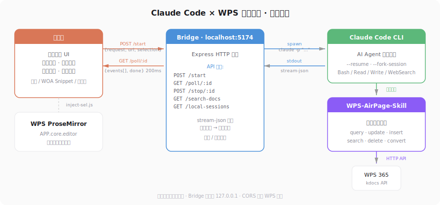
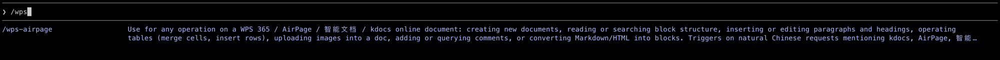

# Claude Code × WPS 智能文档

在 WPS 365 智能文档页面里嵌入 Claude Code 浮动面板。用户用自然语言描述需求，插件自动关联当前文档上下文（标题、URL、选区），通过本地 Bridge 调用 Claude Code CLI 完成文档读写操作。

> 当前版本：**v0.5.0**

## 架构



```
WPS 365 页面 (365.kdocs.cn) / WOA 桌面客户端
├── content.js (isolated world) — 浮动面板 UI、polling、会话管理、版本更新提醒
├── inject-bridge.js (MAIN world, 持久注入) — ProseMirror 桥接，选区 & 光标状态读取
├── inject-sel.js (MAIN world, 按需注入) — 读取 ProseMirror 编辑器选区（兼容旧路径）
├── background.js (Service Worker) — 监听自动更新完成后重载扩展
│
│  ← HTTP (polling) →
│
└── bridge/server.js (本地 Node.js)
    ├── GET  /health — 健康检查
    ├── GET  /panel — 面板 HTML 页面（供 iframe 加载）
    ├── POST /start — 启动 claude CLI 子进程，返回 session ID
    ├── GET  /poll/:id — 轮询获取流式事件（delta、tool_start、done 等）
    ├── POST /stop/:id — 中止 claude 进程
    ├── GET  /search-docs — 搜索 WPS 文档列表
    ├── GET  /local-sessions — 列出本地 Claude Code 会话（供导入）
    ├── GET  /ext-path — 返回扩展安装路径
    ├── GET  /version — 返回当前本地版本号
    ├── GET  /check-update — 检查 GitHub 远端是否有新版本
    └── POST /self-update — 一键拉取最新版本并重启
```

**为什么用 polling 而不是 SSE/WebSocket？**
WPS 页面的网络环境会中断长连接（Service Worker / 混合内容策略），polling 模式用短连接 JSON 响应，100% 可靠。

## 目录结构

```
wps-cc/
├── install.command       ← 一键安装脚本（双击运行）
├── build-inject.js       ← 构建脚本（生成 dist/ 下注入文件）
├── inject-console.js     ← 控制台注入版源码
├── extension/            ← Chrome/Edge 扩展（Manifest V3）
│   ├── manifest.json
│   ├── content.js        ← 面板 UI + 会话管理 + polling + 版本更新
│   ├── content.css       ← 样式（Obsidian Ember 主题）
│   ├── background.js     ← Service Worker，自动更新后重载扩展
│   ├── inject-bridge.js  ← 持久 ProseMirror 桥接（选区 & 光标）
│   └── inject-sel.js     ← 按需注入到页面读取 WPS 编辑器选区
├── bridge/               ← 本地 Node.js 服务
│   ├── package.json
│   ├── server.js         ← Express 服务 + Claude CLI 子进程管理 + 自动更新
│   ├── start-bridge.command
│   └── stop-bridge.command
├── dist/                 ← 预构建注入脚本
│   ├── woa-snippet.js    ← WOA 桌面客户端 Snippet
│   ├── woa-sidebar.js    ← WOA 侧栏模式
│   └── inject-console.js ← 控制台一行注入
├── skills/
│   └── WPS-AirPage-Skill/ ← WPS 智能文档操作 Skill
└── docs/
    ├── architecture.svg   ← 架构图
    └── skill-check.png    ← Skill 检测截图
```

## 快速开始

### Step 1：安装基础环境

在 Finder 中双击 `install.command`，脚本将自动完成：

1. 检测并安装 Node.js、Claude Code CLI
2. 部署 WPS-AirPage-Skill 到 `~/.claude/skills/`
3. 安装 Bridge 依赖
4. 注册 **launchd 开机自启服务**（崩溃自动重启）
5. 验证 Bridge 启动
6. 检测默认浏览器，引导安装扩展

> 安装完成后 Bridge 将作为 macOS 后台服务持续运行，无需手动启动。
>
> 首次双击 `.command` 文件如果被 macOS 拦截，右键 → 打开 即可。

### Step 2：安装客户端

根据你的使用环境选择一种方式：

**方式 A：Chrome/Edge 浏览器扩展（推荐用于 WPS 365 网页版）**

`install.command` 最后一步会自动打开扩展管理页并引导安装。如需手动安装：

1. 打开 `chrome://extensions`（或 `edge://extensions`）
2. 开启「开发者模式」
3. 点「加载已解压的扩展程序」→ 选 `extension/` 文件夹
4. 打开 WPS 365 文档，右下角出现橘色 CC 按钮

**方式 B：WPS协作 桌面客户端（WOA）**

WOA 不支持浏览器扩展，通过 DevTools Snippet 注入：
1. 请先打开协作的调试模式
2. 点击打开Console控制台
3. 切到 **Sources（源代码）** → 左侧 **Snippets（代码段）**
4. 点 **+ New snippet**，命名为 `Claude Code`
5. 把 `dist/woa-snippet.js` 的内容粘贴进去，**Ctrl+S** 保存
6. 右键该 snippet → **Run**（或 Ctrl+Enter）

> 以后每次打开 WOA 只需：Sources → Snippets → 右键 Claude Code → Run
>
> 再次运行可关闭面板。

**方式 C：任意网页环境（控制台注入）**

在 DevTools Console 中粘贴 `dist/inject-console.js` 的内容即可注入完整面板。适用于有控制台访问权限但无法安装扩展的环境。

### Step 3：安装后验证

#### 1. 检查 Skill 安装状态

打开 Claude Code，输入 `/wps`，如果显示出 `wps-airpage` Skill 即为安装成功：



#### 2. 获取个人 Cookies（首次必做）

在 Claude Code 中输入：

```
/WPS-AirPage-Skill 请帮我登录下
```

Skill 会自动打开 WPS 认证界面，完成登录后凭据保存到 `~/.claude/secrets/wps365.json`。

> **首次安装耗时提示：** 首次运行需要下载 Playwright + Chromium 内核（约 150 MB），请耐心等待。下载完成后会自动弹出 WPS 登录页面，登录即可。后续使用无需重复下载。

### Step 4：使用

- 点 **CC 按钮** 或按 **⌥+J**（Mac）/ **Alt+J**（Windows）打开面板
- 在文档中选中文字，面板输入框上方自动显示选区引用
- 输入请求，按 **Enter** 发送
- 实时看到工具调用步骤 → 流式文字输出 → 完成后自动折叠步骤摘要

### 手动安装（不使用 install.command）

如果不希望使用一键脚本，可手动完成以下步骤：

#### 前置要求

- Node.js 18+
- Claude Code CLI（`claude --version` 可用）

#### 1. 部署 WPS-AirPage-Skill

将 Skill 复制到 Claude Code 的 skills 目录，并安装依赖：

```bash
mkdir -p ~/.claude/skills
cp -R skills/WPS-AirPage-Skill ~/.claude/skills/
cd ~/.claude/skills/WPS-AirPage-Skill && npm install --production
```

#### 2. 启动 Bridge

**方式 A（推荐，后台服务）：** 运行 `./install.command`，脚本会注册 launchd 服务实现开机自启和崩溃恢复，即使你只需要 Bridge 也可以使用

**方式 B（前台运行）：** 在 Finder 中双击 `bridge/start-bridge.command`

**方式 C（终端前台）：**
```bash
cd bridge && npm install && npm start
```

> 停止前台进程：关闭终端窗口，或双击 `bridge/stop-bridge.command`

#### 3. 安装客户端

参见上方 [Step 2：安装客户端](#step-2安装客户端)

## 核心功能

### 文档选区捕获
WPS 编辑器是 ProseMirror 架构，标准 `window.getSelection()` 不可用。插件通过 `inject-bridge.js` 持久驻留页面主世界，建立 ProseMirror 桥接，实时监听选区变化和光标状态，通过 `postMessage` 与 content script 通信。

### 流式输出 + 中间过程
Bridge 解析 Claude CLI 的 `stream-json` 输出，转换为前端事件：
- `status` — 启动/等待/回复中
- `thinking_start/done` — 深度思考指示
- `tool_start/detail/result` — 工具调用步骤（中文标签 + 描述）
- `delta` — 文字增量流式渲染
- `done` — 完成，步骤自动折叠为摘要

### 多轮会话
利用 Claude CLI 的 `--resume <session_id>` 机制：
- 同一会话内多条消息共享上下文
- 清空对话 → 开启新 session
- 每个文档的会话独立隔离

### 导入本地 Claude Code 会话
从 `~/.claude/projects/` 扫描本地 session 文件，提取标题和摘要，用户通过列表选择导入。使用 `--fork-session` 创建分支，不干扰终端正在运行的 session。

### 一键自动更新
- 面板每 10 分钟轮询 Bridge `/check-update` 接口，检查 GitHub 是否有新版本
- 发现新版本时，面板顶部展示更新横幅，支持查看 Release 详情或点击「立即更新」
- 一键更新流程：Bridge 拉取最新 Release → 解压覆盖 → 重启服务 → Service Worker 检测版本变化自动重载扩展
- `install.command` 自动收集当前终端的代理和认证环境变量（`HTTP_PROXY`、`ANTHROPIC_API_KEY` 等），写入 launchd plist，确保后台服务继承正确的网络环境

## 安全说明

- **Bridge 仅监听 127.0.0.1**：不对外暴露，只有本机可访问
- **CORS 限制**：仅允许来自 `365.kdocs.cn`、`www.kdocs.cn` 和 `file://`（WOA Electron）的请求
- **`--dangerously-skip-permissions`**：Bridge 调用 Claude CLI 时跳过权限确认，以实现自动化操作。这意味着 Claude 可以不经确认地读写本地文件和执行命令。请确保你信任你发送的请求内容
- **WPS Cookie**：存储在 `~/.claude/secrets/wps365.json`，不会出现在代码或日志中

## 环境变量

| 变量 | 默认值 | 说明 |
|------|--------|------|
| `PORT` | `5174` | Bridge 监听端口 |
| `CLAUDE_BIN` | `claude` | Claude CLI 路径 |
| `CC_TIMEOUT_MS` | `600000` (10分钟) | 单次请求超时 |

## 常见问题

**Q: 点发送后提示「无法连接 Bridge」？**
Bridge 没启动。如果使用一键安装，运行 `launchctl kickstart -k gui/$(id -u)/com.wps-claude.bridge` 重启服务；否则运行 `cd bridge && npm start`。

**Q: 选区捕获不到？**
确认在文档编辑区域选中了文字（非面板内部）。WPS 编辑器需要通过 ProseMirror API 读取。

**Q: 导入本地会话后报错「No conversation found」？**
Session 文件可能已过期或被清理。尝试导入更近期的会话。

**Q: 内存占用过高？**
正常情况下 WPS 页面约 1-2 GB。如果超过 3 GB，检查是否打开了 DevTools（DevTools 自身会占用大量内存）。

**Q: Bridge 后台服务管理？**
```bash
# 查看日志
tail -f ~/.claude/logs/bridge.log

# 重启服务
launchctl kickstart -k gui/$(id -u)/com.wps-claude.bridge

# 停止服务
launchctl unload ~/Library/LaunchAgents/com.wps-claude.bridge.plist

# 卸载服务
launchctl unload ~/Library/LaunchAgents/com.wps-claude.bridge.plist && rm ~/Library/LaunchAgents/com.wps-claude.bridge.plist
```
